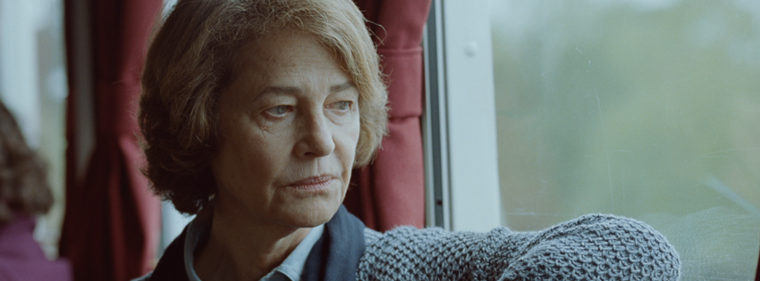

Probabil cel mai bun aspect legat de premiile Oscar este acela că sunt multe categorii și mulți nominalizați. Acest număr ridicat de nume se poate dovedi folositor când vrei să sapi mai adânc, dincolo de cei împinşi în față de publicitate, dincolo de filmele bune, dar de consum, pentru public. Așadar, anul acesta, dacă privim dincolo de Revenanți, Mad Macși, Marțieni sau de true story-urile, de data aceasta, mai jurnalistice, gazetărești, precum Spotlight (2015) și The Big Short (2015). Dacă mintea noastră trece dincolo de glumele cu Leo și Oscarul mult visat și de travestitul lui Redmayne, iar într-un final, refuzăm să ne lăsăm impresionați de nume precum Jennifer Lawrence sau Cate Blanchett, o vom găsi în aceste categorii populare, pe Charlotte Rampling nominalizată la cea mai bună actriță în rol principal pentru filmul 45 Years (2015). Acum, dacă stau să mă gândesc bine, nu cred că este aşa greu de găsit, până la urmă, ea este cel mai necunoscut nume din listă, iar asta îi poate atrage pe cei plictisiți de atenția care le-a fost acordată celorlalte vedete.

Filmul britanicului Andrew Haigh, nu are o poveste complicată. Geoff Mercer (Tom Courtenay) și Kate Mercer (Rampling) sunt căsătoriți de patruzeci și cinci de ani, iar îndelungata perioadă trebuie sărbătorită. Numărul nu este unul care se sărbătorește de obicei, dar aflăm că la patruzeci de ani, când ar fi trebuit să celebreze realizarea, Geoff a avut probleme de sănătate. Filmul începe într-o zi de luni și îi urmărim pe cei doi, până sâmbătă, care este ziua petrecerii celor patruzeci și cinci de ani. Ceea ce dă startul acțiunii filmului este scrisoarea pe care Geoff o primește și în care este informat că, vechia sa iubită, Katya, a fost găsită într-un ghețar. Când erau tineri Geoff și Katya urcaseră în munți în Elveția, iar ea alunecase într-o crăpătură în gheață și murise. Odată cu acea scrisoare, fantoma unei iubiri care părea că a apus, învie și bântuie fiecare colț al vieții pe care Geoff și Kate au construit-o împreună.

Vă mărturisesc că prima oară când am văzut filmul nu am fost impresionat, era o poveste subtilă ajutată de niște interpretări la fel de tăcute și ușor de trecut cu vederea. Ceva îmi scăpase atunci, pentru că fără să îmi dau seama, multe zile la rând nu am fost capabil să îmi scot finalul din minte. Iar de fiecare dată când mă gândeam la el, alte momente din film îmi apăreau printre amintiri și nu mai voiau să plece. Niciun film din cele pe care le-am văzut în ultima vreme nu a reușit să mă pună așa pe gânduri. Așadar, a trebuit să-l mai văd încă odată pentru a mă convinge pe deplin.

Filmul lui Haigh este absolut cutremurător, însă imensa durere pe care o transmite este îmbrăcată într-o dramă liniștită, fapt ce o face mai greu de observat și apreciat așa cum ar trebui. Totul începe în acea luni, cu acea scrisoare. Și foarte rar mi-a fost dat să văd cum un personaj care nici măcar nu apare dirijează întregul film. Asta este ceea ce îți lovește cel mai puternic conștiința când privești 45 Years, din momentul în care Geoff citește scrisoarea, Katya apare în fiecare colț al lumii celor doi. Amintirea ei are o forță atât de mare încât este capabilă să șteargă patruzeci și cinci de ani de căsnicie. Kate observă cât de vii sunt imaginile iubirii din trecut în mintea soțului ei și decide să afle mai multe. Ea vorbește cu el, iar cu fiecare cuvânt, din fiecare secvență, se instalează o tot mai pregnantă alienare între cei doi. Se îndepărtează așa mult că ne putem întreba dacă au fost vreodată apropiați. Dar apropiați nu fizic, ci mental și sufletește, acea situație în care inimile lor să bată doar una pentru alta. Și neputința de a da un răspuns, sau frica de a accepta adevărul, este cel mai dureros aspect al filmului.

În unele seri Geoff începe să-i povestească despre Katya și acea plimbare pe munte. Atunci, noi, dar mai ales Kate, înțelegem că iubirea apusă, iubirea întreruptă prea brusc de moarte, nu dispăruse niciodată, ci adormise într-o stare de așteptare perpetuă. Bucăți încă vii din relația dispărută sunt găsite de Geoff în pod, într-un magnific moment în care simțindu-i lipsa, Kate începe să îl caute și îl găsește acolo în mijlocul nopții. Aici poate fi observată foarte clar subtilitatea filmului, când la replica lui: „I found it.”, Kate îi răspunde: „You didn’t find it. You went looking for it in the middle of the night and that’s not the same thing at all.”. Astfel lumina este aruncată asupra comportamentului lui Geoff. Poate melodiile pe care le ascultă nu sunt alese la întâmplare, poate cărțile pe care vrea să le citească la fel. Atitudinea lui se schimbă ușor, dar sigur. Este îngândurat și indispus, mereu mintea lui pare preocupată de ceva și pare că uită cu fiecare zi să mai trăiască în prezent. Acest fel în care inima trecutului continuă să bată ,și mai mult, să își înfigă rădăcinile în prezent, evocă puterea unei dureri mute. Este acea tristețe care apare când înțelegi foarte bine că omul de lângă tine s-ar putea să nu fie cine crezi că e, iar tot ceea ce ați trăit împreună este doar o mare minciună. Asta cred că este ceea ce Kate conștientizează la finalul filmului. Răscolește trecutul soțului ei până nu mai poate să îndure niciun cuvânt legat de acel subiect, totuși ea află ceea ce, poate, era mai bine să rămână ascuns. Căci de multe ori prețul pe care trebuie să-l plătești pentru adevăr este fericirea.

Interpretarea excelentă a celor doi face ca fiecare emoție să pară autentică. Privindu-i ți se dezvăluie un joc al gesturilor mici, al tonalităților care trec neobservate, al privirilor care strigă, dar pe care nimeni nu le aude. Și astfel se construieşte o imagine care portretizează cu mare finețe fragilitatea relațiilor umane, faptul că niciodată nu poți fi sigur de ce se ascunde în mintea partenerului tău și că oricât de mult timp ai petrece împreună cu el sau cu ea, niciodată nu vei ști cine este cu adevărat. Din acest episod al vieții celor doi, putem extrage mai multe concluzii. Putem vorbi despre viitorul lor, despre totala însingurare a fiecăruia în propriile amintiri, dar și despre căutarea adevărului și prețul pe care îl plătești pentru asta.

În urma lui 45 Years rămân întrebări amestecate cu o durere surdă, ultimul zâmbet al lui Kate, melodiile ale căror versuri ne fac să privim totul cu alți ochi și o ușoară melancolie când înțelegem cât de firavă și vulnerabilă este dragostea dintre oameni. Charlotte Rampling merită fără discuții premiul, chiar dacă nu cred că va câștiga, fiind la fel ca în 2013 cu Amour (2012), când Emmanuelle Riva, cu o interpretare fenomenală, a pierdut în fața mult mai tinerei și mai pe placul publicului, Jennifer Lawrence. Dar poate e mai bine așa, până la urmă, câți credeți că își vor aminti de cum a jucat Lawrence? În schimb, Riva este și va rămâne eternă.

**NOTA : 9.5**