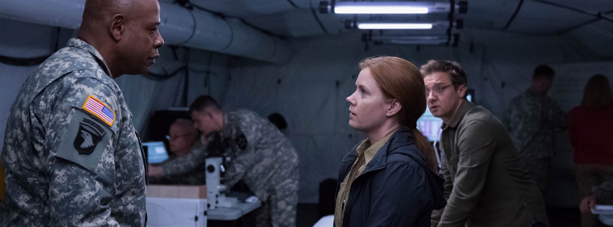
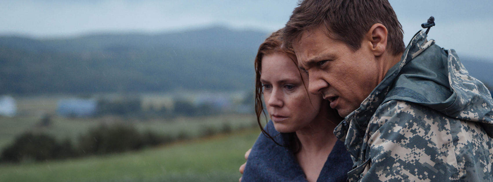

<!--StartFragment-->

Când unul dintre regizorii mei favoriți scoate un nou film, nu am cum să nu îl aștept altfel decât cu mare entuziasm și puțină frică. Spun frică deoarece mereu există șansa că așteptările, din cauza mărimii lor, să nu fie satisfăcute. Însă, pentru oricine îl urmărește pe [Denis Villeneuve](http://www.imdb.com/name/nm0898288/) de ceva timp ([Incendies](http://www.imdb.com/title/tt1255953/?ref_=nm_knf_t2), [Enemy](http://www.imdb.com/title/tt2316411/?ref_=nm_knf_t4), [Prisoners](http://www.imdb.com/title/tt1392214/?ref_=nm_knf_t1), [Sicario](http://www.imdb.com/title/tt3397884/?ref_=nm_knf_t3)), îi spun că poate, fără absolut nicio teamă, să vizioneze cel mai nou film al acestuia, [Arrival (2016)](http://www.imdb.com/title/tt2543164/?ref_=nm_flmg_dr_2).

Cu [Amy Adams](http://www.imdb.com/name/nm0010736/?ref_=tt_ov_st_sm) și [Jeremy Renner](http://www.imdb.com/name/nm0719637/?ref_=tt_ov_st_sm) în rolurile principiale, Arrival, este prima întâlnire a regizorului canadian cu genul science fiction. Dr. Louise Banks (Adams), expertă în lingvistică și Ian Donnelly (Renner), un om de știință foarte talentat, sunt aduși împreună să rezolve o situație de urgență excepțională: 12 nave extraterestre au aterizat pe Pământ în 12 colțuri diferite ale lumii și nimeni nu știe care este scopul lor.

La prima vedere, originalitatea poveștii lasă de dorit, astfel de idei fiind printre cele mai dezbătute, abordate și analizate subiecte de majoritatea fanilor SF. Și totuși, sub conducerea lui Villeneuve, ceva, așa cum era de așteptat, se schimbă și transformă Arrival într-unul dintre cele mai bune filme din 2016. Și, cu cât mai puține detalii posibile, pentru a nu vă strica surpriza, am să încerc să explic ce stă în spatele concluziei mele.

Filmul începe lent, într-o manieră emoționantă, care prin imagistică și sunet captează instant atenția. Mai exact, este prezentată drama Louisei, un anumit eveniment din viața ei, a cărui importanță crește constant pe parcurs ce povestea progresează. În același timp, acesta este un indiciu că mai mult decât despre extratereştrii și nave spațiale, Arrival privește înspre omenire și probleme sale.

Așa ajungem la ceea ce este probabil esența filmului: comunicarea. Pentru că nu întâmplător armata a chemat-o pe Louise, și nu întâmplător cele 12 nave sunt în colțuri diferite ale lumii. Totuși, contrar a ceea ce bănuiți, Louise nu este acolo pentru a traduce ceea ce spun oamenii din celelalte țări, nu, ea trebuie să descifreze ceva mult mai complex: limba extratereștrilor. Iar modul în care Villeneuve arată acest proces este ceea ce te face să privești ecranul sălii de cinema cu o fascinație mută până în ultima secundă.

Mai mult decât un film de mister sau thriller, Arrival este o creație care excelează printr-o atmosferă și un ritm inconfundabile. De remarcat aici este lentoarea mișcării aproape constante a camerei lui [Bradford Young](http://www.imdb.com/name/nm2284226/?ref_=ttfc_fc_cr17) ([Selma](http://www.imdb.com/title/tt1020072/?ref_=nm_knf_t1), [A Most Violent Year](http://www.imdb.com/title/tt2937898/?ref_=nm_knf_t2)), acompaniată în fiecare moment cheie de muzica memorabilă și puțin melancolică a lui [Jóhann Jóhannsson](http://www.imdb.com/name/nm0433580/?ref_=ttfc_fc_cr16) ([Prisoners](http://www.imdb.com/title/tt1392214/?ref_=nm_knf_t1), [The Theory of Everything](http://www.imdb.com/title/tt2980516/?ref_=nm_knf_t2), [Sicario](http://www.imdb.com/title/tt3397884/?ref_=nm_knf_t1)). Aceste elemente dau filmului o cursivitate incredibilă, trecerea timpului devine insesizabilă și descleștarea din universul lui Villeneuve este tot mai grea.

Pe lângă drama personală a Louisei, ajutată de interpretarea sinceră și emoționantă a lui Adams, își face apariția o dilemă mai complicată, o dramă a întregii omeniri, dacă o putem numi așa, anume lipsa majoră de comunicare. Am putea argumenta aici că limba și limbajul sunt ceea ce ne unește și ne desparte în același timp. Iar asta reiese din modul în care țările din întreaga lume vor să soluționeze situația de urgență. Unii vor să atace, fiecare are propria interpretare a mesajului „*vizitatorilo*r”, fiecare înțelege ce vrea, și mai mult, face ce vrea fără a aștepta opinia celorlalți.

E greu să vorbesc despre acest film fără a da prea multe indicii, pentru că aceste constante și neașteptate twist-uri sunt ceea ce fac din Arrival să fie o experiență atât de universal plăcută. Este o combinație extrem de reușită între un subiect de blockbuster și viziune de regizor de filme arthouse, ceea ce foarte rar am văzut în cinematografia recentă.

Tensionat, artistic, surprinzător, emoționant, ar fi primele cuvinte pe care le ai în minte după terminarea filmului. Arrival este o adevărată realizare cinematografică și un pas important în maturizarea și rafinarea stilului regizorului, pe care orice iubitor de cinema nu ar trebui să o rateze.

**NOTA : 9.5**

<!--EndFragment-->