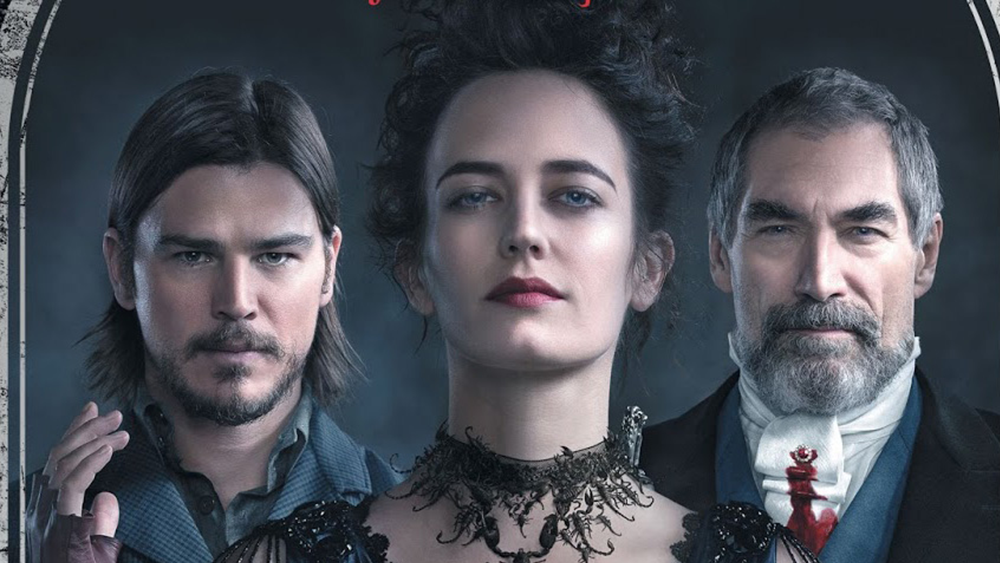

<!--StartFragment-->

Întunecat, violent, elegant și de o frumusețe intoxicantă, **Penny Dreadful (2014-2016)** este unul dintre acele seriale care scapă, care atrage un public restrâns și loial, dar nu capătă niciodată recunoașterea pe care o merită cu adevărat. Aparținând genului horror, creația lui John Logan spune o poveste greu de explicat din cauza amalgamului de elemente pe care le reunește de-a lungul celor trei sezoane. Este vorba, de sigur, de vrăjitoare, vampiri, vârcolaci, demoni, Dorian Gray (Reeve Carney), Victor Frankenstein (Harry Treadaway), morți vii și așa mai departe.

Pentru a nu vă răpi foarte mult din mister, am să vă descriu foarte puțin firul narativ principal: Vanessa Ives (Eva Green) este o femie care a fost blestemată. Acest blestem abătut asupra ei o face să fie dorită cu ardoare de toate forțele întunecate, dar în special de doi demoni, Lucifer (care vrea să îi cucerească sufletul) și Dracula (care vrea să pună stăpânire pe latura carnala a ei; **pentru a păstra recenzia fără spoilere nu am să vă dau numele actorului**). Iar ceea ce vom vedea aici este lupta fără oprire a Vanessei și echipei sale împotriva acestor forțe ale răului.

Din această scurtă descriere pare că se pun bazele unui serial care prezintă niște fapte dintr-o lume fantastică și plină de acțiune, ceea ce Penny Dreadful chiar este, însă doar până la un anumit punct. Mai mult decât momente pline de lupte însângerate sau urlete demonice, găsim în serial o poezie rară care este transmisă chiar cu ajutorul acestor elemente supranaturale. De unde și această atmosferă specială care te cuprinde în timp ce intri în lumea personajelor de pe ecran. Cred că cel mai bun cuvânt prin care poate fi descris Penny Dreadful este englezescul *oddball*, pe care eu l-aș traduce aici drept *ciudățel.*

Povestea principală, precum și multiplele fire narative secundare care se petrec la sfârșit de scol 19, curg și se întrepătrund frumos, dar adesea pot fi observate și separat, moment în care te întrebi la ce ai început să te uiți și totul începe să pară puțin stupid. Un Dorian Gray apărut de nicăieri pare să nu aibă niciun sens, un Frankenstein drogat și aproape înnebunit de obsesia de a cuceri moartea pare puțin prea mult, prea forțat. Cu toate astea, ceva leagă totul, iar acest element de fuziune este Vanessa, jucată într-o manieră care captivează și cei mai sceptici ochi de către Green.

Cu cât petreci mai mult timp cu acest serial, observi că totul gravitează în jurul Vanessei și că, de fapt, Penny Dreadful la esență este o dramă încărcată de un romantism sensibil și melancolic. Acest fapt este vizibil în toate cele trei sezoane, dar mai pregnant în primul și ultimul, cel de-al doilea fiind mult mai axat pe elementele de suspans, horror și acțiune. Însă cât de bine sunt dozate aceste caracteristici! Penny Dreadful este ceea ce orice horror ar trebui să fie, înfricoșător într-un mod profund, fără să recurgă la trucuri ieftine; dramatic, dar fără să ajungă o telenovelă; plin de monștrii, dar care cară în suflet o sensibilitate ce o depășește pe cea umană.

John Logan ne aduce o lume și o poveste la fel de ciudate ca personajele sale. Totuși, poate că *ciudat* nu este cuvântul potrivit aici, mai degrabă *diferit*. Un serial altfel care nu s-a temut să fie violent, cinic, brutal de șocant, adesea foarte extravagant, chiar dacă asta l-a adus mereu cu un pas mai aproape de sfârșit.

<!--EndFragment-->