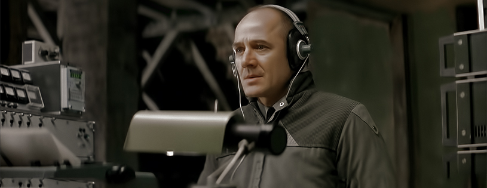

<!--StartFragment-->

Subiectele politice nu sunt pe placul tuturor. Nu din cauză că nu ar fi bune, sau abordate într-o manieră interesantă, ci mai degrabă pentru că mulţi privitori sunt sătuli de aceste poveşti. Comunişti, nazişti, fascişti, poliţii secrete, cenzură, reguli aberante, viață grea, am văzut toate acestea în multe filme, prea multe ca să încep să enumăr. Şi totuşi, mereu când mi se pare că ştiu tot ce se putea despre un anumit subiect, apare de undeva ceva diferit. Iniţial tinzi să crezi că nu e nimic nou şi că mai bine nu îţi pierzi timpul. Dar ceva continuă să te atragă, poate posterul, poate actorii, poate laudele din jurul filmului, nu poţi spune exact. Astfel mi s-a întâmplat şi mie cu **The Lives of Others (2006)** al lui **Florian Henckel von Donnersmarck**.

Când am citit pentru prima oară un mic sinopsis al filmului, nu am ştiut exact la ce să mă aştept. Povestea are loc în anul 1984 în *Republica Democrată Germană (RDG)*. Gerd Wiesler (**Ulrich Mühe**) este un căpitan din cadrul *Stasi* (poliţia secretă din RDG). În timp ce acesta se află alături de colegul său Anton Grubiz (**Ulrich Tukur**) la teatru, devine suspicios în legătură cu scriitorul piesei jucate, Georg Dreyman (**Sebastian Koch**). În ochii lui Wiesler acesta este prea perfect ca să nu aibă ceva de ascuns. Astfel aprobarea pentru urmărirea lui Dreyman este dată, iar apartamentul său va fi împânzit de microfoane ascunse. Totuşi, în timp ce ascultă stabilit în podul blocului, Wiesler începe să fie tot mai absorbit de viaţa scriitorului şi iubitei sale Christa-Maria Sieland (**Martina Gedeck**).

Eu urăsc orice legat de comunism. Mi se pare un subiect expirat şi nu mai văd rostul abordării acestui regim politic într-o creație artistică. Şi totuşi, am văzut filmul lui von Donnersmarck de trei ori. De ce? Pentru că **The Lives of Others** este pur şi simplu frumos. În niciun caz nu mi-a dat impresia că este doar un simplu film despre comunism, deşi acesta reprezintă un subiect major al filmului. Însă este doar o bucată din creaţia lui von Donnersmarck. Prima oară când am văzut filmul nu am acordat atenţie detaliilor ce ţineau de poliţia secretă. Atunci ce mi-a plăcut a fost mai mult gestul lui Wiesler şi felul în care acesta se schimbă pe parcursul filmului.

A doua oară în schimb, am rămas uimit de felul în care a fost portretizat comunismul aici. Toată paranoia şi stricteţea regimului. Felul în care cetăţenii erau urmăriţi, uneori chiar de cei apropiaţi, mi s-a părut îngrozitor. Cenzura artei, incompetenţa şi incorectitudinea sistemului au devenit o imagine care m-a lovit puternic. Poate asta s-a întâmplat şi pentru că prima oară nu acordasem o mare importanţă acestui aspect. Acum Wiesler nu mai era angajatul perfect care îşi descoperă latura sensibilă. Nu, a doua oară a devenit un personaj mult mai complex pentru mine. I-am putut analiza mult mai bine viaţa, lumea goală în care trăia. Şi atunci am înţeles aproape complet cum a devenit atât de fascinat de viaţa celor pe care îi urmărea.

Şi a treia oară, am văzut filmul complet. Aici slăbiciunile sistemului din RDG au devenit pur și simplu clare. Și pentru că în mare parte le vedem prin ochii lui Wiesler, adăugăm și ultima piesă la portretul acestui personaj complex. Probabil prima oară schimbarea lui Wiesler poate părea prea bruscă şi puţin forţată. Însă nu este deloc aşa. El nu îşi pierde încrederea în sistem dintr-o dată, ci gradat. O glumă despre un om aflat la putere. Un motiv ascuns în spatele urmăririi pe care o desfăşoară. Vorbele inocente şi sincere ale unui copil în lift. Lipsa de onoare şi coloană vertebrală a colegilor săi. Toate strică puţin câte puţin iluzia în care trăia căpitanul Weisler.

Însă, poate nu ăsta este chiar motivul principal al schimbării sale. Acesta este, dacă ne gândim metaforic, doar sămânţa. Pentru a putea creşte şi prospera are nevoie şi de un sol propice. Iar acest sol este însăşi viaţa lui Weisler. Când îl priviți pe acest om trebuie să fiţi întotdeauna conştienţi că el trăieşte într-o goliciune absolută. Nu are prieteni, nu citeşte cărţi, nu se duce la teatru sau la filme, nu are familie, nu are iubită, nu are nimic în afară de slujba sa. Faţa sa este asemenea unei măşti. Infectat până în cele mai adânci colţuri ale fiinţei sale de activitatea pe care o desfăşoară, Weisler este complet inexpresiv. Nu zâmbeşte niciodată, nu râde, nu plânge, pare să nu aibă nicio emoţie. Este asemenea unui vas gol şi tocmai de aceea poate să fie aşa uşor umplut cu ceva. Iar întâmplarea face ca acel ceva să fie pasiunea şi iubirea din viaţa lui Georg Dreyman.

Toma de Aquino mi se pare că a spus: *„Lucrurile pe care le iubim ne spun cine suntem”.* Am amintit acest citat pentru că eu cred că aşa trebuie să-l privim pe Weisler dacă vrem să-l înţelegem complet. Lumea lui goală se schimbă treptat. Începe să fie fascinat de iubire, de literatură, de teatru. Şi cel mai important, înţelege greşelile din sistem şi face ceea ce crede că este bine. Devine aproape ca un fel de înger păzitor al celor pe care îi ascultă. Un înger care trece peste propria invidie şi peste lipsurile sale pentru a putea face un bine mult mai mare.

Toţi actorii joacă excelent. Însă interpretarea lui Mühe este memorabilă. Inexpresivitatea lui Weisler, comportamentul său lipsit de emoţie, tonul vocii parcă fără viaţă, toate sunt jucate cu mare subtilitate. Mühe reuşeşte să ne ofere un personaj greu de citit la prima vedere, căruia nu îi ştim gândurile şi pe care trebuie să-l urmărim cu mare atenţie dacă vrem să îl cunoaştem cu adevărat.

**The Lives of Others (2006)** al lui Florian Henckel von Donnersmarck este un film tăcut şi subtil cu accente de thriller politic şi dramă. Una dintre cele mai bune portretizări artistice ale comunismului şi problemelor din interiorul acestuia, dar și o analiză fascinantă a psihicului unui personaj. Într-un final, un adevărat film de valoare, minunat din multe puncte de vedere şi cu un sfârșit care sigur va naşte emoţie şi un sentiment de satisfacţie în sufletul oricărui privitor.

**NOTA : 9.5**

<!--EndFragment-->