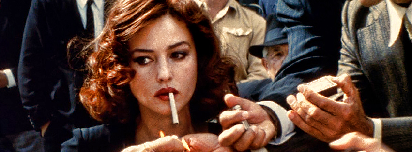

<!--StartFragment-->

“*Time has passed, and I have loved many women. And as they've held me close... And asked if I will remember them, I've said, "Yes, I will remember you." But the only one I've never forgotten is the one who never asked...”*. Aceasta este concluzia lui Renato Amoroso (**Giuseppe Sulfaro**) la finalul filmului **Malèna (2000)**, concluzie pe care nu am putut să o uit, chiar dacă au trecut mai bine de doi ani de când am văzut filmul lui **Giuseppe Tornatore**. De aici a pornit şi ideea mea să alcătuiesc aceast top în care sper că veţi găsi ceva pe placul vostru, chiar dacă sunteţi interesaţi de subiect sau nu.

**10. Rushmore (1998)**

Printre primele filme făcute de talentatul şi puţin ciudatul regizor **Wes Andreson**, **Rushmore**, spune povestea lui Max Fischer (**Jason Schwartzman**) un băiat de 15 ani care se îndrăgosteşte pasional de Rosemary Cross (**Olivia Williams**), o profesoară care predă la şcoala elementară Rushmore. În continuare povestea începe să se complice când Herman Blume (**Bill Murray**), un bărbat bogat ai cărui copii învaţă la Rushmore, îşi face apariţia. Din acel moment Max va fi prins într-un complicat triunghi amoros, fiindcă Herman şi Rosemary încep să se îndrăgostească.

Deşi filmul lui Andreson este în mare parte o comedie puţin mai ciudată, dacă este privit cu atenţie povestea devine mult mai complexă. **Rushmore** este o explorare amuzantă a iubirii tinere. Este asemenea unei călătorii văzute prin ochii unui băiat a cărui vastă lume interioară este fascinantă. Felul în care Max luptă pentru dragostea sa cu rivalul şi în acelaşi timp prietenul său Herman este interesant şi plăcut de privit. Filmul este o comoară mică şi ciudată a cinematografiei care sigur te va binedispune.

**9. Harold and Maude (1971)**

Continuăm lista cu o alegere la fel de ciudată (sau poate chiar mai mult) ca cea anterioară. **Harold and Maude** regizat de **Hal Ashby** are una dintre cele mai neobişnuite, amuzante şi emoţionate poveşti de dragoste pe care le-am văzut în cinema. Harold (**Bud Cort**) este un adolescent bogat care are o plăcere foarte ciudată, este obsedat de moarte şi îşi petrece timpul participând la înmormântări şi privind ultimele momente din viaţă ale fiinţelor din jurul său. Toate acestea sunt încercări de a-i atrage atenţia mamei sale. Dar atunci când Maude (**Ruth Gordon**) apare, adevărata direcţie a filmului este dezvăluită. Inima poveştii este neaşteptata şi puţin probabila legătură care se formează între bătrâna de 79 de ani şi Harold.

Foarte interesant este aici felul cum personajele luptă contra celui mai mare adversar al iubirii, timpul. Harold şi Maude sunt două suflete care şi-au început *„cursa”* în momente diferite şi s-au întâlnit mult prea târziu. Diferenţa de vârstă, indiferent de cât de optimist privim situaţia, transformă iubirea lor într-una imposibilă. Totuşi, lupta lor continuă, felul în care învaţă să descopere frumuseţea vieţii, apropie filmul de nivelul unei opere de artă nemuritoare.

**8. Two Lovers (2008)**

Vizionarea filmului realizat de **James Gray** este o experienţă intensă şi captivantă. **Two Lovers** prezintă povestea lui Leonard Kraditor (**Joaquin Phoenix**), un bărbat care locuieşte împreună cu părinţii săi după ce a fost părăsit de logodnica sa. Destul de brusc personajul nostru va fi blocat într-un triunghi amoros dureros de privit. Iubirea lui Leonard este ruptă în două. Jumătate este pentru Sandra (**Vinessa Shaw**) o femeie senzuală şi directă care îşi mărturiseşte dragostea pentru el. Iar cealaltă jumătate este luată de Michelle (**Gwyneth Paltrow**), noua sa vecină, o femeie blondă şi sofisticată al cărui farmec îi atrage tot interesul. Din acel moment viaţa lui Leonard se va afla pe un drum care pare să nu ducă nicăieri. Deşi Michelle se droghează și are un iubit care este însurat, Leonard contiună să fie tot mai atras de ea. Aleargă naiv spre o dragoste pe care nu poate avea crezând că poate trece peste orice imperfecţiune a ei.

Cu un ritm lent şi matur, **Two Lovers** se transformă tot mai mult într-un studiu de caracter de un realism puternic şi greu de privit uneori.

**7. Malèna (2000)**

Sursa citatului de la început, filmul lui **Giuseppe Tornatore,** este unul dintre cele mai grăitoare exemple de iubire neîmplinită. Chiar dacă sentimentele naive ale lui Renato pentru Malèna (**Monica Bellucci**) nu sunt tocmai esenţa filmului, creaţia lui Tornatore este o alegere perfectă pentru acest top. Întreaga acţiune a filmului este văzută din perspectiva lui Renato, un băiat aflat la pubertate care se îndrăgosteşte complet de Malèna, o femeie foarte atrăgătoare pe care toţi bărbaţii vor să o cucerească.

Ceea ce deosebeşte sentimentele băiatului de ale celorlalţi, este inocenţa lor nepătată. Iubirea lui Renato este sinceră şi îl împinge să facă orice pentru a-i atrage atenţia femeii. Toate aceste încercări disperate de a fi observat şi felul copilăresc de a iubi par ireale, sunt ca scoase dintr-un vis. Frumuseţea pe care Renato ne face să o vedem este atât minunată, cât şi dureroasă, fiindcă înţelegem aşa bine ca visele sale vor rămâne doar nişte vise şi iubirea pe care şi-o doreşte atât de mult va fi întotdeauna neîmplinită.

**6. (500) Days of Summer (2009)**

Să iubeşti pe cineva pentru că sunt aşa cum vrei tu să îi vezi, nu cum sunt de fapt în realitate, este o problemă serioasă care apare în multe relaţii. Exact acest lucru îi se întâmplă lui Tom (**Joseph Gordon-Levitt**), un scriitor de felicitări care se îndrăgosteşte de noua sa colegă, Summer (**Zooey Deschanel**), încă din primul moment în care o vede. Deşi este o femeie a cărei sinceritate poate fi incomodă, care îi explică intenţiile sale încă de la început, Tom nu pare să o înţeleagă. Summer este un mister, caldă ca o zi din anotimpul după care este numită şi elegantă ca un fulg de zăpadă. Dar ceea ce o face aşa specială este că fiecare gest pe care îl face este autentic, nu se preface, nu joacă teatru.

Tom iubeşte misterul din jurul ei, este extrem de atras de el, dar nu vrea să-l lase să existe. El, ca majoritatea bărbaţilor, crede că îl poate descifra, că odată cu trecerea timpului situaţia se va schimba şi va putea să o facă pe Summer să se potrivească dorinţelor sale. Dar asta se va dovedi mult mai uşor de zis decât de făcut, după cum vom vedea în filmul lui **Marc Webb** despre cele 500 de zile de suişuri şi coborâşuri, fericire şi tristeţe, într-una dintre cele mai bune portretizări a iubirii în societatea contemporană.

**5. Brief Encounter (1945)**

De ce înşelăm? Infidelitatea, mai exact adulterul, este subiectul multor filme. De obicei acesta este tratat ca un lucru rău, este blamat de societate fiindcă toţi văd căsătoria ca pe ceva sacru, o legătură inviolabilă. Dar cum putem să-i judecăm pe oamenii care devin infideli fără să vrea asta? Filmul lui **David Lean** oferă un răspuns parţial. Adulterul apare atunci când nevoile unui partener nu sunt satisfăcute. Iar pentru a înţelege asta vom avea nevoie de toată răbdarea şi bunătatea pe care le avem.

Laura (**Celia Johnson**) este soţia care povesteşte cum ea şi Dr. Alex Harvey (**Trevor Howard**) s-au întâlnit şi au format o legătură romantică. Chiar de la început, putem observa că relaţia lor stă sub semnul hazardului. Nimic nu este permanent, nimic nu este sigur, iar relaţia lor spontană îşi aşteaptă sfârşitul. Cu o temă simplă, **Brief Encounter**, spune povestea unei iubiri fără speranţă născută dintr-o coincidenţă şi reluată la nesfârşit în filmele ce au urmat.

**4. My Night at Maud’s (1969)**

Pentru iubitorii subiectelor complexe cu tentă filosofică filmul lui Eric Rohmer este exact ce le trebuie. El, Jean-Louis (**Jean-Louis Trintignant**) este un bărbat catolic de 34 de ani care se duce la biserică unde se îndrăgosteşte de o femeie blondă după ce o vede mai multe duminici la rând. Dar lucrurile se schimbă puţin după noaptea în care se întâlneşte întâmplător cu un vechi prieten (**Antoine Vitez**), profesor de filosofie şi ateist marxist, care îi face cunoştinţă cu (**Françoise Fabian**). Şi atunci povestea chiar devine fascinantă.

Maud nu este ca nicio femeie pe care ai întâlnit-o. Ea se află departe, este înaintea timpului în care trăiește. Divorţată, cu un copil, este o femeie deşteaptă căreia îi place să flirteze şi care devine interesată de Jean-Louis. Când Vidal pleacă din apartament, Jean-Louis şi Maude sunt prinşi într-una dintre cele mai atent observate scene ale comportamentului uman. Acţiunea este alcătuită din dialoguri intelectuale care conțin dileme morale. Împreună vorbesc despre sex, iubire, căsătorie şi divorţ toată noaptea în timp ce Jean-Louis se luptă cu tentaţia de a cădea în braţele lui Maud care îi exploatează fiecare slăbiciune a propriilor iluzii legate de iubire şi idealul feminin.

**3. Lost in Translation (2003)**

Pentru a înţelege cu adevărat această alegere trebuie să vedeţi filmul **Sofiei Coppola** înainte. Ok, deci întregul scop al iubirii este să găseşti pe cineva ca tine, pe cineva care să te înţeleagă şi să îţi fie alături indiferent de situaţie. Bob Harris (**Bill Murray**) şi Charlotte (**Scarlet Johansson**) sunt două suflete pierdute care se găsesc într-o mare de necunoscut. Ea are undeva la 20 de ani, iar el aproape 50. Amândoi nu sunt satisfăcuţi de mariajul în care se află şi împreună încep să construiască o legătură greu de exprimat în cuvinte.

De fapt, filmul însuşi nu are nevoie de foarte multe cuvinte. Personajele sale nu îşi strigă iubirea, fiindcă nu au nevoie să o facă. O privire pierdută este de ajuns, pentru că ochii lor vorbesc o limbă pe care doar ei o înţeleg. Relaţia celor doi, de la întâlnirea întâmplătoare de la început până la sfârşitul emoţional, este dominată de o pasiune tăcută care depăşeşte simpla dorinţă sexuală. Dar ce face iubirea imposibilă de aici aşa emoţionantă pentru privitor este autenticitatea situaţiilor şi dialogurilor. Pare foarte real şi asta ne ajută să empatizăm cu personajele şi criza prin care trec.

**2. In the Mood for Love (2000)**

Filmul lui **Wong Kar Wai** poate fi considerat o adevărată definiţie elegantă şi subtilă a iubirii neîmplinite. Dl. Chow (**Tony Chiu Wai Leung**) şi Su Li-zhen/Dna. Chan (**Maggie Cheung**) se mută în acelaşi timp într-un bloc din Hong Kong în 1962. Devin foarte buni prieteni şi la un moment dat descoperă că partenerii lor îi înşală (soţia lui cu soţul ei şi invers). Încă din acel moment se observă ingeniozitatea lui Wong care rămâne dezinteresat de adulter. El nu glorifică aventura, ci alege să se concentreze pe victimele sale.

Până acum povestea pare previzibilă, sunt sigur că veţi crede că cei doi, Chow şi Su, se vor îndrăgosti unul de altul şi vor avea o aventură a lor. Dar filmul este mult mai complex de atât. Da, cei doi se îndrăgostesc, dar în acelaşi timp îşi încătuşează aceste sentimente. De ce? Pentru că personajele lui Wong sunt nişte oameni onorabili. Ei se luptă cu inimile lor pe care le închid adânc şi care dau astfel naştere unei iubiri neîmplinite unice, cutremurătoare şi imposibil de uitat.

**1. A Short Film About Love (1988****)**

La început una din cele 10 părţi ale **Decalogului**, unul dintre cele mai ambiţioase proiecte ale regizorului **Krzysztof Kieslowski**, **A Short Film About Love** este că majoritatea filmelor apărute din genialitatea lui Kieslowski, unic şi cu o abordare excepţională a sentimentelor. Filmul spune povestea lui Tomek (**Olaf Lubaszenk**), un tânăr singuratic şi timid care își petrece timpul urmărind-o printr-un telescop pe Magda (**Grazyna Szapolowska**), vecina sa. Zi după zi, o priveşte şi încercă în orice fel să fie cât mai aproape de ea. Dragostea sa fără speranţă se apropie de o obsesie, dar în mod ciudat cu ajutorul talentului imens al lui Kieslowski nu se transformă în aşa ceva.

Iubirea lui Tomek este dificil de înţeles din cauza profunzimii intense amestecate cu o naivitate copilărească, două calităţi pe care Magda nici nu şi le poate imagina. Însă, într-un final, atât Magda cât şi Tomek, sunt străini faţă de sentimentul de iubire, ceea ce face filmul dificil de urmărit. Emoţiile brutale sunt autentice. Durerea, umilinţa şi stângăcia pe care la transmit aceşti actori puţin cunoscuţi publicului larg, sunt atât de reale încât ne fac să ne întrebăm ce este iubirea sau dacă măcar un astfel de sentiment există. Filmul este artă pură, un studiu profund asupra concepţiei pe care o avem faţă de iubire, care sigur va avea un impact puternic pentru orice privitor.

<!--EndFragment-->