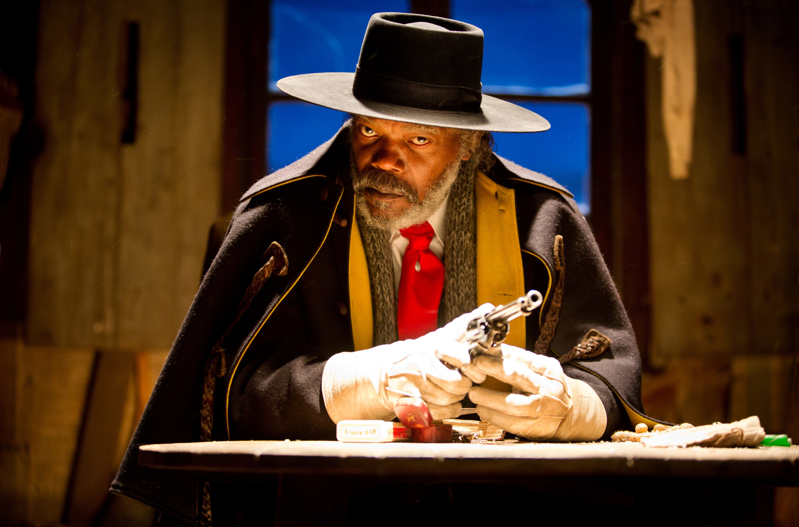

<!--StartFragment-->

N-am fost niciodată un mare fan al filmelor lui **Quentin Tarantino**, dar producții precum **Reservoir Dogs (1992)**, **Pulp Fiction (1994)** sau seria **Kill Bill (2003-2004)** m-au făcut să îl urmăresc cu interes de-a lungul anilor. Concluziile mele sunt fluctuante, de la un **Inglourious Basterds (2009)** doar bunicel, la un **Django Unchained (2012)** foarte bine făcut și extrem de plăcut de privit și într-un final, la cel mai nou film al său, **The Hateful Eight (2015)**. Unde se plasează acesta printre creațiile lui Tarantino? Rămâne de văzut.

Maiorul Marquis Warren (**Samuel L. Jackson**) este un vânător de recompense care rămâne fără cal pe drum și trebuie să oprească o trăsură pentru a nu muri de frig din cauza viscolului. În trăsură dă peste John Ruth (**Kurt Russell**), un alt vânător de recompense, care o ține captivă pe Daisy Domergue (**Jennifer Jason Leigh**), o criminală a cărei recompensă este de zece mii de dolari. Ruth îl primește cu greu pe Warren și pornesc la drum spre Red Rock unde Daisy va fi spânzurată. Îl vor mai întâlni pierdut prin zăpadă și pe Chris Mannix (**Walton Goggins**), viitorul șerif din Red Rock. Împreună se vor opri la Galanteria lui Minnie (**Dana Gourrier**), unde sunt așteptați de ceilalți odioși: Bob (**Demián Bichir**), Oswaldo Mobray (**Tim Roth**), Joe Gage (**Michael Madsen**) și generalul Sandy Smithers (**Bruce Dern**). Iar acestor personaje principale li se mai adaugă din când în când, aducând un plus de umor, birjarul O.B Jackson (**James Parks**).

Prima mea îngrijorare când am citit despre filmul lui Tarantino a fost durata. Aproape trei ore, și cum îl cunoșteam pe regizor, aproape trei ore de vorbărie și iar vorbărie care să creeze faze comice și o tensiune în continuă creștere, gata să explodeze. Într-adevăr, de la primele minute în film, exact asta primești. Mai puțin partea cu tensiunea. De la primul cadru regizorul nu lasă impresia, ci chiar nu se grăbește. Personajele sunt angajate într-un dialog dinamic, foarte activ și extrem de amuzant pe alocuri, dar care nu pare să ducă spre nimic exact. Tot în acest ritm lent decurge și restul călătoriei până la galanterie. Pe tot parcursul acestui moment m-am întrebat care ar trebui să fie motivația mea pentru a vedea filmul până la capăt? Ca să nu fiu înțeles greșit, jocul actorilor este minunat, muzica și imaginea sunt ireproșabile, dar povestea spre ce vrea să se îndrepte mai exact? Ar trebui să fiu curios dacă reușește Ruth să o ducă pe Domergue la spânzurătoare? Pentru că dacă e așa, nu sunt. Nu ştiu cât durează asta în minute, dar prima parte (după cum e alcătuit filmul, cred că primele două capitole), nu reușește să îți captiveze interesul suficient de mult cât să te facă se vrei să vezi filmul până la capăt.

Totuși, cei patru ajung la Galanteria lui Minnie până la urmă, iar odată cu sosirea lor acțiunea devine mai interesantă. Minnie și soțul ei par să fii plecat în grabă și au lăsat locul în mâinile unui necunoscut pe nume Bob. Impresia că ceva nu este în regulă devine tot mai pregnantă. Iar Tarantino alege parcă să se angajeze în ceva ce amintește foarte mult de jocurile interactive de pe calculator. Pentru cei care nu știu foarte bine, acestea sunt acele jocuri în care practic tu construiești povestea. Și te plimbi de la un caracter la altul și vorbești, iar povestea se construiește în funcție de alegerile pe care le faci. Așa mi s-a părut că se întâmplă și în **The Hateful Eight**. Toate personajele, în special maiorul Warren, vorbesc unele cu altele. Încearcă să își dea seama motivele ascunse, minciunile care sunt păstrare cu strictețe și să aducă la lumină misterul din galanterie. Sunt întreprinse mici interogatorii, uneori amuzante, alte ori serioase, în urma cărora spectatorul primeşte câte o piesă pentru completarea puzzle-ului. Marea diferență între jocuri și film este lipsa libertății spectatorului. Noi nu putem să alegem nimic, toate alegerile sunt deja făcute de regizor. Cât de bine sunt făcute este discutabil.

Cum am văzut și în Reservoir Dogs sau în Django, lui Tarantino îi place să construiască momente tot mai tensionate care să se finalizeze exploziv, fie prin ceva neprevăzut, fie printr-o acțiune intensă și violentă. Deși, mai bun decât Inglourious Basterds, **The Hateful Eight** nu a reușit să mă prindă complet în acest sens. Misterul este bun, tensiunea și încordarea în schimb se lungesc prea mult, atât de mult încât momentele în care acestea izbucnesc parcă nu au suficientă forță. Iar dacă în 2009 **Christoph Waltz**, printr-o interpretare fenomenală, făcea să merite fiecare minut așteptat, aici nu există nimeni care să ofere aceeași satisfacție.

Normal, se joacă bine, dar interpretările sunt departe de a fi memorabile. Există o oarecare distanță între privitor și personaje, iar pe lângă faptul că e aproape imposibil să te regăsești în vreunul, nici nu ai pe cineva pe care să îl admiri sau de care să îți pese. Atât acţiunea, cât și ceea ce se transmite țintesc doar spre amuzament și distracție, ceea ce le face îndepărtate de public. **The Hateful Eight** pare din acest punct de vedere un fel de film cu supereroi, dar mai violent, mai pentru adulți și datorită influenței lui Tarantino, mai bun.

Pentru cei care vor să nu riște nimic atunci când vor să vadă un film bun, **The Hateful Eight** este alegerea perfectă. Mai ales dacă nu ai văzut foarte multe filme făcute de Tarantino. Pentru că dacă ești familiarizat cu stilul regizorului, probabil vei pleca puțin dezamăgit. Filmul este satisfăcător, dar regizorul nu aduce nimic nou, același mod de a construi personajele, o poveste bună dar departe de a fi cea mai originală și același stil *„entertaining”* care pare că se vrea a fi înlocuit, măcar puțin.

**NOTĂ: 8**

<!--EndFragment-->