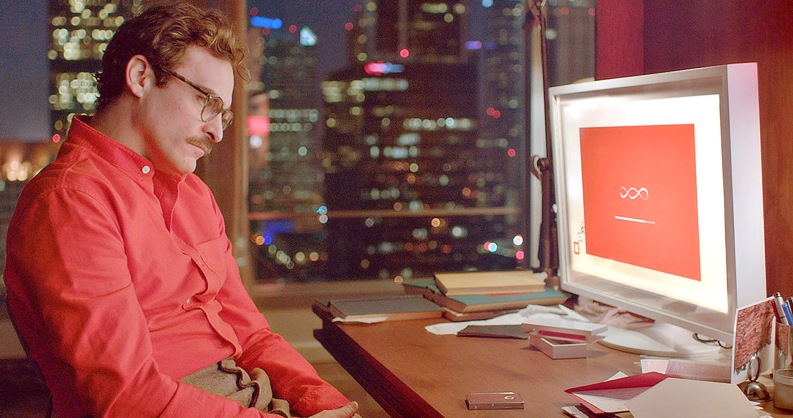
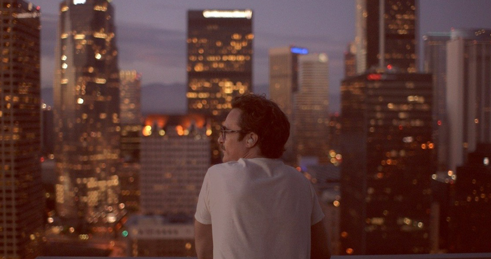

<!--StartFragment-->

Stau la masă. De afară țipete puternice răzbat pângă la geamul meu de la etajul patru. Un bărbat se ceartă la telefon. Iubita, soția, nu am de unde să știu, trebuie să-i suporte răgetul sălbatic, în care nicio urmă de control nu pare să mai existe. Mă uit la ceilalți oameni, nimeni nu pare să-l bage în seamă, dar știu că toți sunt conștienți de prezența sa și doar politețea și bunul simț și poate puțină frică, îi împiedică să îl atenționeze. Sau poate este altceva, poate ei, la fel cum am înțeles și eu mai târziu, au realizat că în astfel de probleme, în decepțiile inimii, nimeni nu poate aduce împăcare. Este datoria celor doi, actorii principali pierduți într-o iubire care le-a luat mințile, să iasă la capăt din labirintul încâlcit al sentimentelor. Totuși, furia bărbatului prin contrastul puternic cu atitudinea personajului despre care voi vorbi azi, mi-a amintit de filmul lui Spike Jonze, Her (2013). Dată fiind toată această perioadă, plină de tot felul de sărbători artificiale închinate iubirii, m-am gândit că ar fi un moment bun să-l revăd și să mă las împins din nou într-o analiză mai profundă a unuia dintre cele mai complexe sentimente pe care un om le poate simți.

Theodore (Joaquin Phoenix) este un om singur, divorțat, a cărui slujbă presupune alcătuirea de scrisori pentru diferite ocazii. Cu cei mai mulți dintre clienți are o colaborare îndelungată, de aici și diversele detalii pe care le cunoaște despre ei și pe care le folosește în scrisori. Dintre toate atributele pe care i le putem pune, poate cel cu rezonanța cea mai puternică este acela de singuratic. Fiecare moment din viața lui evocă o puternică alienare față de lumea în care trăiește. Iar, mai mult ca sigur, această însingurare cauzată de imposibilitatea de a trece peste dragostea pierdută, îl împinge spre căutarea iubirii într-un loc improbabil. Și pentru că filmul este la bază un science fiction, acțiunea are loc într-un viitor în care tehnologia a ajuns să imite aproape până la perfecțiune ființa umană. Spun asta, deoarece obiectul iubirii lui Theodore va fi un sistem de operare, care își pune singură numele de Samantha (voce Scarlett Johansson).

Her este unul dintre acele filme pe care le-am așteptat și doar de la o imagine, doar de la un trailer văzut în grabă mi-am zis că va fi bun. E un simț, o intuiție care apare după ce ai ajuns să cunoști foarte bine o lume și începi să prezici tot mai bine ceea ce va urma. Cât de mult s-a aliniat filmul așteptărilor mele? Complet, până în punctul în care, la un moment dat, a reușit să le depășească.

Omul și tehnologia, efectele progresului în această arie asupra ființei umane, sunt unul dintre subiectele mele favorite. Iar viziunea lui Jonze este foarte apropiată de credințele mele în acest sens. Ceea ce este interesant și de apreciat în film este felul în care elementele SF nu sunt folosite pentru a impresiona, ci ca modalități de construire și transmitere a ideilor. Asemănător cu WALL-E (2008) în acest aspect, Her portretizează o lume tot mai dependentă de dispozitivele digitale și alienarea cauzată de acest comportament. Totodată, este un univers în care totul funcționează prea bine. Sistemele de operare bazate pe control vocal acceptă și îndeplinesc comenzi tot mai complexe, iar totul se desfășoară folosind doar o simplă cască foarte mică, pe care trebuie să o pui în ureche. În acest sens nu ai cum să nu remarci și îmbrăcămintea personajelor, de la bluzele și cămășile colorate, până la pantalonii cu talie înaltă, specifici societății imaginate și aspectul îngrijit al oamenilor (părul, machiajul, mustața lui Theodore). Dar și apartamentele lor și locul de muncă sunt dominate tot de această grijă, până la o perfecțiune plăcută vizual, dar sterilă. Iar în acest mediu, care îndeamnă la o adâncă melancolie, iubirea cumva se va naște.

Theodore o cumpără și o instalează pe Samantha. Iar aici cred că o parte din public va privi totul cu neîncredere și nu va putea să înţeleagă cum e posibil să te îndrăgostești de un sistem de operare, adică ceva ce nu există, ceva ce este doar o voce dintr-un computer. Pentru a nu exista dubii, totul începe de la structura personalității lui Theodore. Aici, ajută extrem de mult și interpretarea subtilă și sinceră al lui Phoenix, care se mulează perfect pe imaginea omului singur, dar simplu. Cum s-a îndrăgostit personajul său de un SO? Simplu: din singurătate. Cel mai ușor dragostea se naște în singurătate. Și dacă este un aspect la care filmul excelează, atunci acela este construirea unei societăți cu oameni tot mai conectaţi, dar paradoxal, din ce în ce mai singuri.

Dacă ne uităm la relația lor din perspectiva omului singur, atunci totul este clar. Mai exact, cine nu ar vrea să găsească pe cineva care să manifeste un interes necondiționat pentru el? Pe cineva care să fie mereu acolo, ori de câte ori ai nevoie? Pe cineva inteligent, amuzant, amabil, care poate să poarte discuții pe orice temă și care îți face viața mai ușoară? Dar mai ales, pe cineva care să te înțeleagă și cu care să vorbești când te simți singur? Pentru oricine este singur o astfel de persoană este o mină de aur, aproape un miracol. Și Samantha este toate acestea, este acea EA care îl ajută pe Theodore să uite de durere. Îl face să râdă și îi este alături în nopțile pline de singurătate.

Totuși, nu este de ajuns să le privim relația doar prin prisma izolării lui Theodore. Deși am afirmat simplitatea caracterului său, el are o anumită calitate care îl separă de ceilalți, în special de majoritatea bărbaților, și care nu îl face să fie complet comun. Foarte clar și fără nicio subtilitate o putem găsi în replica prietenului său de la muncă, Paul (Chris Pratt), care uimit de frumusețea scrisorilor sale, îi spune că „este jumătate bărbat, jumătate femeie”, iar partea sa interioară este sigur cea de femeie. Aceste cuvine descriu perfect sensibilitatea personajului. Sentimentele sale sunt puternice, dar fragile, ceea ce face cumva ca iubirea lui să fie feminină. Iar din fragmentele relației trecute, înţelegem că există anumite lipsuri în el, o incapacitate de a gestiona responsabilitățile și problemele care apar în cuplu.

Foarte semnificativă în acest sens este scena în care se întâlnește cu fosta soție, Catherine (Rooney Mara), pentru a semna actele de divorț. Acest moment echivalează cu o trezire dintr-un vis frumos. Jonze ne păcălește cu succes în a susține relația cu sistemul de operare, în a o considera ceva normal. Este nevoie de vorbele lui Catherine pentru a ne aduce la realitate, atât pe noi, cât și pe Theodore. Acum se simte cel mai puternic contrastul dintre artificial și uman. Samantha vorbește ca un om, gândește ca un om, începe chiar să aibă sentimente, și totuși, este imposibil să o considerăm o ființă umană. Oricât de bine ar imita niște comportamente, impresia de falsitate nu dispare și chiar dacă iubirea lor este frumos de privit, ea nu poate să o ajute să depășească statutul de obiect.

De aici încolo apropierea sfârșitului este tot mai inevitabilă. Îndoiala a fost sădită în mintea lui Theodore și oricât ar vrea nu poate să nu își asculte rațiunea. Lipsa corporalității devine o problemă, dar și invers, inteligența și abilitățile Samanthei se interpun tot mai mult în relația lor. Iubirea se încheie, dacă asta fost, iar el rămâne din nou singur. Dar acum ceva e diferit, Jonze nu lasă personajul ca la început, ci ne arată că din tot ceea ce a trăit a învățat ceva. Rezoluția din final, așa cum au remarcat și alții, este una destul de simplă, dar mult ignorată și trecută cu vederea în viața reală. Este vorba de acceptare și iubire de sine. Theodore trece peste relația cu fosta soție și pierderea Samanthei și decide să privească în interior după iubire. Unii au criticat concluzia asta, ca fiind prea evidentă și simplă, iar eu le spun că aș fi făcut la fel, dacă nu aș ști atât de bine că lucrurile simple sunt adesea cele pe care le uităm cel mai ușor.

Așadar, dacă vreți să vedeți un film despre iubire în aceste zile, fie că sunteți singuri sau împreună cu cineva, Her este recomandarea cea mai bună pe care pot să v-o dau. Foarte rar veți mai găsi o analiză atât de sinceră, prezentată cu o subtilă melancolie dulce, a unui sentiment atât de cunoscut și caracteristic omului, dar despre care adesea va constata, dacă se gândește mai atent, că nu știe mai nimic.

**NOTĂ: 9.5**

<!--EndFragment-->